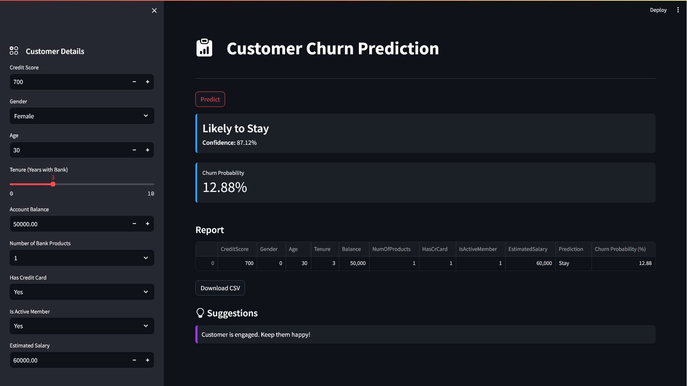
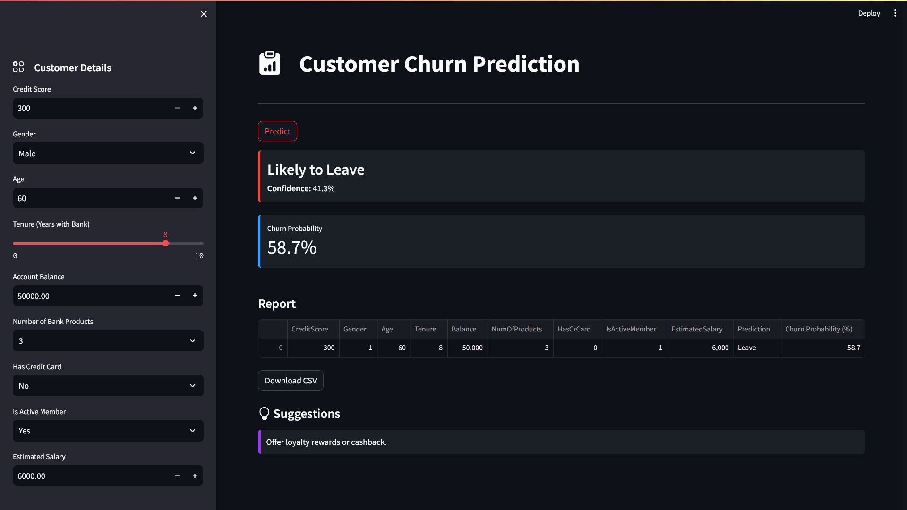
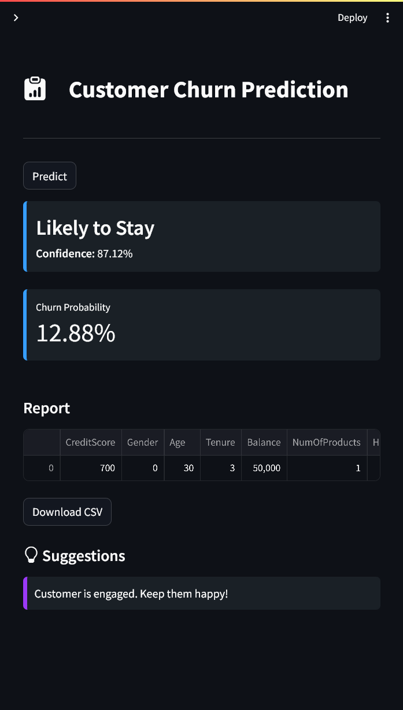
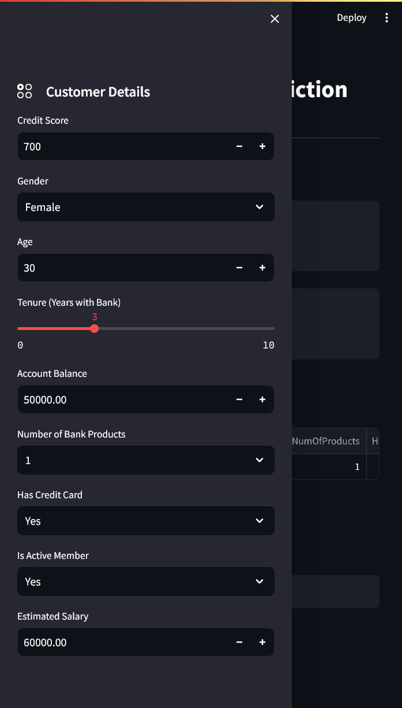

# Customer Churn Prediction

## A web application built with **Streamlit** that predicts whether a customer will leave the bank using anusing a trained Machine learning model (Support Vector Machine - SVM) . 

## The app takes in customer details like credit score, age, balance, etc., and gives Results.

### Features

-  Predicts customer churn using SVM model
- Displays churn probability
- Provides retention suggestions based on profile
- Allows download of prediction report as CSV
- Scales input data using pre-fitted scaler
- Minimal, responsive UI with Streamlit

###  Technologies Used

---

### Main Screen

&nbsp;&nbsp;&nbsp;&nbsp;

&nbsp;&nbsp;&nbsp;&nbsp;&nbsp;&nbsp;&nbsp;&nbsp;
### Responsive design

  
  &nbsp;&nbsp;&nbsp;&nbsp;&nbsp;&nbsp;&nbsp;&nbsp;&nbsp;&nbsp;&nbsp;&nbsp;&nbsp;&nbsp;&nbsp;&nbsp;&nbsp;&nbsp;&nbsp;&nbsp;&nbsp;&nbsp;&nbsp;&nbsp;&nbsp;&nbsp;&nbsp;&nbsp;&nbsp;&nbsp;&nbsp;&nbsp;&nbsp;&nbsp;&nbsp;&nbsp;
  

---

##  Model Building Steps

1. **Data Collection**  
   Collected historical customer data from Kaggle.

2. **Exploratory Data Analysis (EDA)**  
   - Checked missing values
   - Distribution of numerical features
   - Churn ratio

3. **Data Preprocessing**  
   - Label encoded categorical variables (Gender, etc.)
   - Scaled numerical features using `StandardScaler`

4. **Feature Selection**  
   - Removed irrelevant columns like `RowNumber`, `CustomerId`, `Surname`
   - Selected top predictors using correlation and domain knowledge

5. **Model Training**  
   - Split data into train/test (80/20)
   - Used `SVC(probability=True)` from `sklearn`
   - Tuned hyperparameters with GridSearchCV

6. **Evaluation**  
   - Accuracy, Confusion Matrix, ROC-AUC Score
   - Exported model with `joblib`

7. **Deployment with Streamlit**  
   - Built interactive UI for inputs
   - Displayed prediction and suggestions
   - CSV report export functionality

---

